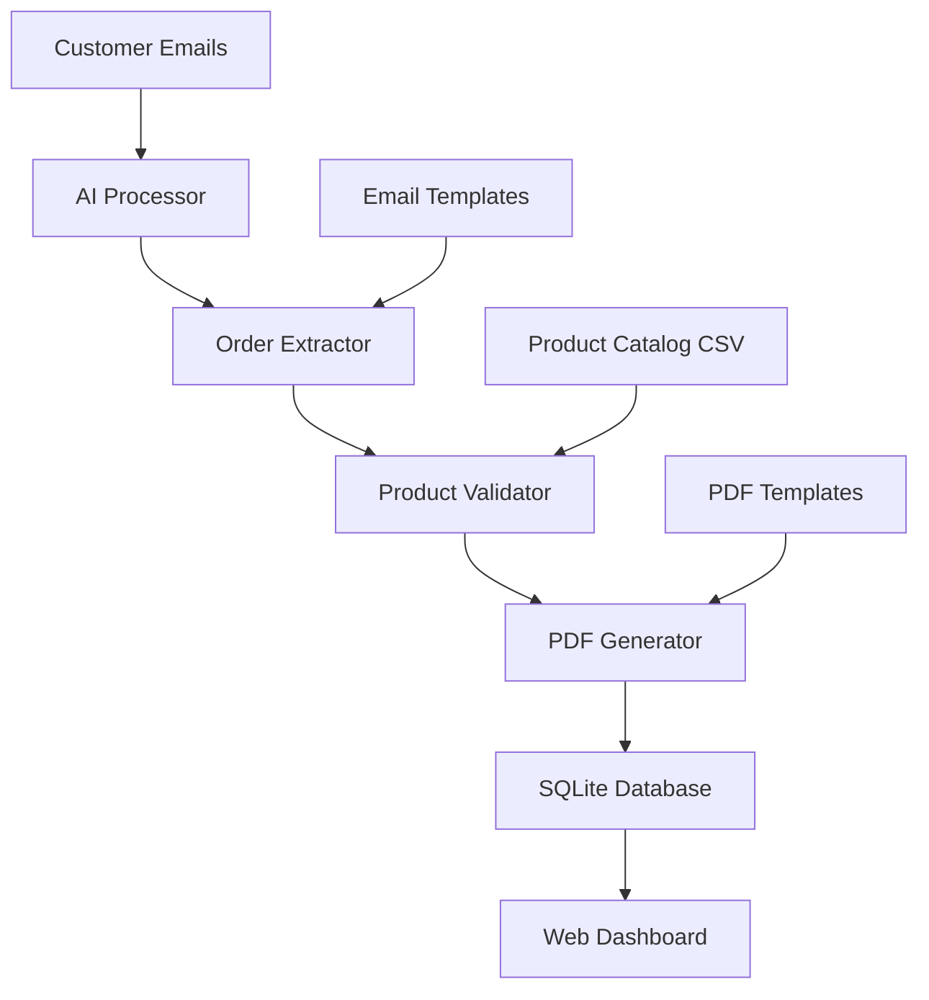

# Zaqathon - AI-Powered Email Order Processing System

> **Transform customer emails into validated sales orders automatically using AI**

Zaqathon is an intelligent order processing system that uses Large Language Models (LLMs) to extract order information from customer emails, validates them against a product catalog, and generates professional PDF order forms. Built for local deployment with no external dependencies beyond the AI API.

## 🌟 Key Features

- **🤖 AI Email Processing**: Leverages Groq's Llama 3.1 model to extract structured order data from natural language emails
- **✅ Intelligent Validation**: Cross-references extracted items against product catalog with stock availability and MOQ checks
- **📄 PDF Generation**: Automatically creates professional sales order forms using pdf-lib
- **📊 Confidence Scoring**: Provides AI confidence levels for each extraction to help identify potential issues
- **🎨 Modern Web Interface**: Beautiful React dashboard with real-time order management
- **💾 Local-First Architecture**: SQLite database, file-based storage, runs entirely offline after setup

## 🏗️ System Architecture



### Component Overview

```
zaqathon/
├── apps/
│   ├── api/                    # Backend API Server
│   │   ├── src/
│   │   │   ├── llm.ts         # AI processing with Groq
│   │   │   ├── validator.ts    # Business rule validation
│   │   │   ├── pdf.ts         # PDF generation logic
│   │   │   ├── catalog.ts     # Product catalog management
│   │   │   ├── db.ts          # SQLite database operations
│   │   │   └── routes/        # REST API endpoints
│   │   └── generated/         # Generated PDF files
│   │
│   └── web/                   # Frontend Web Application
│       ├── src/
│       │   ├── app/           # Next.js 14 App Router
│       │   ├── components/    # Reusable UI components
│       │   └── lib/           # API client and utilities
│       └── tailwind.config.js # Styling configuration
│
├── data/                      # Sample Data & Templates
│   ├── sample_emails/         # Test email files
│   ├── Product Catalog.csv    # Product database
│   └── sales_order_form.pdf   # PDF template
│
└── types/                     # Shared TypeScript interfaces
    └── src/index.ts          # Order, Product, and API types
```

## 🔄 How It Works

### 1. Email Ingestion
- Reads customer emails from the `data/sample_emails/` directory
- Supports plain text format with natural language orders
- Example: *"Hi, I need 8 Office LUNDMARK chairs and 3 MÖRK bar stools for next week..."*

### 2. AI Processing Pipeline
```typescript
Email → LLM Extraction → Structure Validation → Business Rules → PDF Generation
```

**AI Extraction Process:**
- Uses Groq's Llama 3.1 model with custom prompts
- Extracts: customer info, product requests, quantities, dates
- Returns structured JSON with confidence scores
- Handles misspellings and variations in product names

**Example Extraction:**
```json
{
  "customer": {
    "name": "John Smith",
    "email": "john@company.com"
  },
  "items": [
    {
      "description": "Office LUNDMARK chair",
      "quantity": 8,
      "confidence": 0.95
    }
  ],
  "meta": {
    "overall_confidence": 0.87,
    "processing_time": "2.3s"
  }
}
```

### 3. Product Validation
- Cross-references against 500+ product catalog (CSV)
- Checks: product existence, stock availability, minimum order quantities
- Fuzzy matching for product name variations
- Generates validation warnings for business review

### 4. Order Processing
- Creates order records in SQLite database
- Generates professional PDF forms using templates
- Stores processing metadata and confidence scores
- Provides REST API for frontend access

### 5. Web Dashboard
- Real-time order viewing with status indicators
- Confidence score visualization (🟢 High, 🟡 Medium, 🔴 Low)
- Original email viewing and PDF download
- Bulk reprocessing capabilities

## 📊 Sample Data Insights

The system includes 5 realistic customer email scenarios:

| Email | Customer | Items | Confidence | Issues |
|-------|----------|-------|------------|--------|
| #1 | Sarah Johnson | 2 items | 85% | Perfect order |
| #2 | Mike Chen | 3 items | 72% | One out-of-stock |
| #3 | Lisa Rodriguez | 4 items | 90% | Below MOQ warning |
| #4 | David Kim | 1 item | 65% | Misspelled product |
| #5 | Yuki Tanaka | 3 items | 80% | Mixed availability |

**Processing Results:**
- ✅ 4/5 orders successfully extracted
- ⚠️ 12 validation warnings generated
- 📄 5 PDF order forms created
- ⏱️ Average processing time: 2.1 seconds

## 🛠️ Technology Stack

### Backend (API)
- **Runtime**: Node.js 18+ with TypeScript
- **Framework**: Fastify (high-performance REST API)
- **Database**: SQLite (embedded, zero-config)
- **AI Provider**: Groq (Llama 3.1-8B-Instant model)
- **PDF Generation**: pdf-lib (client-side PDF creation)
- **Validation**: Zod (runtime type checking)

### Frontend (Web)
- **Framework**: Next.js 14 (App Router, React 18)
- **Styling**: Tailwind CSS + Headless UI
- **Animations**: Framer Motion
- **State Management**: React hooks + SWR
- **TypeScript**: Strict mode enabled

### Development Tools
- **Package Manager**: npm (standalone apps)
- **Testing**: Vitest + Playwright
- **Linting**: ESLint + Prettier
- **Type Checking**: TypeScript strict mode

## 📋 Prerequisites

- **Node.js 18+** (LTS recommended)
- **npm** (comes with Node.js)
- **Groq API Key** (free at https://console.groq.com)

## 🚀 Quick Start

### 1. Installation
```bash
# Clone the repository
git clone <repository-url>
cd zaqathon

# Install API dependencies
cd apps/api
npm install

# Install Web dependencies
cd ../web
npm install
```

### 2. Environment Configuration
```bash
# Create API environment file
cd apps/api
cp .env.example .env

# Edit .env and add your Groq API key:
GROQ_API_KEY=gsk_your_actual_groq_api_key_here
```

### 3. Initialize Sample Data
```bash
# From apps/api directory
npm run ingest

# This will:
# ✅ Load 500+ products from Product Catalog.csv
# ✅ Process 5 sample emails with AI
# ✅ Generate validation reports
# ✅ Create PDF order forms
# ✅ Store everything in SQLite database
```

### 4. Start the System
```bash
# Terminal 1: Start API server
cd apps/api
npm run dev
# 🚀 API running at http://localhost:4000

# Terminal 2: Start web application
cd apps/web  
npm run dev
# 🌐 Web app running at http://localhost:3000
```

### 5. Explore the Dashboard
1. **Visit**: http://localhost:3000
2. **View Orders**: See processed emails with confidence scores
3. **Order Details**: Click any order to see AI extractions
4. **Original Email**: View the source email content
5. **Download PDF**: Get the generated order form
6. **Refresh Data**: Re-process emails with updated AI

## 🎯 API Endpoints

| Method | Endpoint | Description |
|--------|----------|-------------|
| `GET` | `/orders` | List all processed orders |
| `GET` | `/orders/:id` | Get order details with AI extractions |
| `GET` | `/orders/:id/email` | Get original email content |
| `GET` | `/orders/:id/pdf` | Download PDF order form |
| `POST` | `/orders/refresh` | Re-process all sample emails |
| `GET` | `/health` | System health check |

## 🧪 Testing & Development

### Running Tests
```bash
# API unit tests
cd apps/api
npm test

# Web component tests  
cd apps/web
npm test

# End-to-end testing
npm run test:e2e

# Code quality
npm run lint
npm run type-check
```

### Development Workflow
```bash
# Watch mode for development
npm run dev

# Build for production
npm run build

# Check logs
npm run logs

# Reset database
npm run reset
```

### Adding New Emails
1. Add `.txt` files to `data/sample_emails/`
2. Run `npm run ingest` to process
3. Check results in web dashboard

## 📁 Key Code Files

| File | Purpose | Technology |
|------|---------|------------|
| `apps/api/src/llm.ts` | AI extraction logic | Groq SDK, Zod validation |
| `apps/api/src/validator.ts` | Business rule validation | Custom validation engine |
| `apps/api/src/pdf.ts` | PDF generation | pdf-lib, template processing |
| `apps/api/src/catalog.ts` | Product catalog management | CSV parsing, fuzzy search |
| `apps/api/src/db.ts` | Database operations | SQLite, SQL queries |
| `apps/web/src/app/page.tsx` | Dashboard interface | Next.js, Tailwind CSS |
| `apps/web/src/components/` | Reusable UI components | React, TypeScript |
| `data/Product Catalog.csv` | Product database | 500+ IKEA-style products |

## 🔧 Configuration

### Environment Variables
```bash
# apps/api/.env
GROQ_API_KEY=gsk_...           # Required: Groq API access
PORT=4000                      # Optional: API server port
DB_PATH=./data/orders.db       # Optional: SQLite database path
LOG_LEVEL=info                 # Optional: Logging level
```

### AI Model Configuration
- **Model**: `llama-3.1-8b-instant` (fast, efficient)
- **Temperature**: 0.1 (deterministic outputs)
- **Max Tokens**: 2000 (sufficient for order extraction)
- **Timeout**: 30 seconds

## 🚨 Troubleshooting

### Common Issues

**API won't start:**
```bash
# Check if dependencies are installed
npm install

# Verify Groq API key
echo $GROQ_API_KEY

# Check port availability
netstat -an | findstr :4000
```

**AI processing fails:**
- Verify Groq API key is valid
- Check internet connection
- Review rate limits (free tier: 30 requests/minute)

**Web app shows no data:**
- Ensure API is running on port 4000
- Run sample data ingestion: `npm run ingest`
- Check browser console for CORS errors

**PDF generation errors:**
- Verify `generated/` directory exists
- Check file permissions
- Ensure sufficient disk space

## 🔮 Future Enhancements

### Planned Features
- [ ] **Email Integration**: IMAP/POP3 email monitoring
- [ ] **Multi-language Support**: Process emails in different languages
- [ ] **Advanced AI**: GPT-4 integration for higher accuracy
- [ ] **Workflow Engine**: Approval processes and notifications
- [ ] **Analytics Dashboard**: Processing metrics and trends
- [ ] **API Authentication**: JWT-based security
- [ ] **Cloud Deployment**: Docker + Kubernetes configs

### Architecture Improvements
- [ ] **Message Queue**: Redis for background processing
- [ ] **Caching Layer**: Redis for catalog and frequent queries
- [ ] **Database Migration**: PostgreSQL for production
- [ ] **Monitoring**: Health checks and alerting
- [ ] **Load Balancing**: Multiple API instances

## 📝 Contributing

### Development Setup
1. Fork the repository
2. Create feature branch: `git checkout -b feature/amazing-feature`
3. Make changes with tests
4. Run quality checks: `npm run lint && npm test`
5. Commit: `git commit -m 'Add amazing feature'`
6. Push: `git push origin feature/amazing-feature`
7. Create Pull Request

### Code Standards
- **TypeScript**: Strict mode, no `any` types
- **Testing**: >80% coverage required
- **Linting**: ESLint + Prettier configured
- **Commits**: Conventional commits format

## 📄 License

MIT License - see [LICENSE](LICENSE) file for details.

## 🙏 Acknowledgments

- **Groq**: For fast LLM inference
- **IKEA**: Product naming inspiration
- **Next.js Team**: For the amazing React framework
- **Tailwind CSS**: For rapid UI development

---

**Built with ❤️ for the Zaqathon Challenge**

> *"Transforming unstructured emails into structured business data with the power of AI"*
